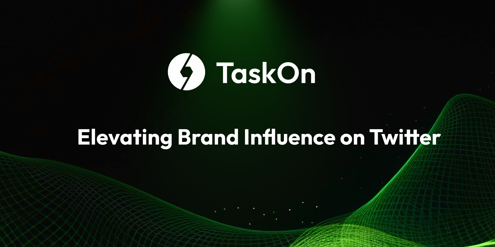

# A Comprehensive Guide to Elevating Brand Influence on Twitter with TaskOn

<figure><figcaption></figcaption></figure>

According to the survey report released by Kepios, nearly `5 billion` people globally are active on `social networks`, accounting for `60.6%` of the `global population.` On average, social network users worldwide spend `over 2 hours daily` on these platforms. This indicates a growing preference for obtaining information and engaging in communication through social media.

For Web3 projects, there is currently no Web3 social product that can rival the traffic of traditional Web2 social media. Therefore, leveraging the popularity of traditional Web2 social media platforms is a necessary means to enhance `brand influence`.

`Twitter(X)`, as a mainstream marketing channel with `over 241 million daily active users` globally, holds significant influence in markets such as the `United States`, `Japan`, `India`, and the `United Kingdom`. Through Twitter marketing, you can establish international brand awareness, engage with users, and enhance brand influence and user loyalty.

Utilizing TaskOn can assist you in conveniently leveraging the functionalities of Twitter, creating your Twitter brand account, and facilitating the execution of brand `marketing strategies`.

### Crafting Brand Impact: Six Twitter Templates on TaskOn

Currently, TaskOn supports a total of `six Twitter task templates`: `Post a tweet with specified content`; `Follow Twitter`; `Like a tweet`; `Quote a tweet w/ hashtag`; `Quote a tweet & tag`; `Retweet`.

Each task template plays a unique role in enhancing brand influence.

#### **Brand Storytelling & Product Promotion: Post a tweet with specified content**

Encourage users to share brand stories, promote products, and convey user-centric brand philosophy; presenting products from the user's perspective can easily resonate with other users.

#### Audience Expansion & Attraction: Follow Twitter

Increase the number of followers, and expand the brand's audience; followers could potentially become customers or loyal fans of the brand.

#### User Interaction & Relationship Building: Retweet and Quote a tweet & tag

Adding a "`Retweet`" task to your campaign serves the purpose of sharing your `brand content` through other `users' posts`, expanding the reach and `exposure` of that particular tweet.&#x20;

With the "`Quote a Tweet & Tag`" task, users are encouraged to interact with the tweet, quoting it with their comments, tagging other users, and spreading your content to a `broader audience`. This form of interaction helps in establishing deeper connections with users.

Whether it's a quote or a retweet, both actions allow you to showcase interesting or valuable content to a `wider audience`, simultaneously propagating the original projects' information across social media. This contributes to building a more extensive social network. The number of quotes and retweets is displayed in the `tweet's status bar`, indicating the level of attention and popularity, thus enhancing `impressions` and increasing the exposure of your brand or official account.

#### Topic Discussion & Exposure Boost: Quote a tweet w/ hashtag

Using `hashtags` from `Twitter Trending` associates your tweet with specific `trending topics`. When users search or click on a particular hashtag on social media platforms, your tweet will be displayed in relevant content, enhancing `exposure opportunities`. Guiding users to `engage` in discussions related to specific topics amplifies the `tweet’s influence` within those topics, ultimately increasing its exposure.

#### Positive Brand Image Building: Like a Tweet

Liking a Tweet indicates user approval and support for the content, contributing to a `positive brand image`. Through likes, users express their appreciation for the content, and liked tweets leave a trace in the user's profile, visible to other followers, arousing their interest. The number of likes is also a key metric for assessing the popularity of a tweet, helping to enhance its `overall impact`.

### Varied Task Combinations for Diverse Impact

Depending on your campaign objectives, combining different task templates will yield effective results.

#### Crafting a Compelling Brand Story on Twitter

If your project just opened a **new social media account**, you need to let users know your `brand story` while expanding the `follower count` to increase account credibility.&#x20;

In TaskOn, when setting up activities, choose “**Post a tweet with specified content + Follow Twitter**”.

When setting up “Post a tweet with specified content”, input the content you want users to share on social media, such as: “From concept to reality, how our product came to be. Let's share some behind-the-scenes stories. \[insert your website or anything related]"

#### Harnessing Trending Waves

If there's a connection between the ongoing industry trends and your project, capitalize on the momentum to promote your `initiative`. Launch a campaign on TaskOn, encouraging users to retweet your tweet and quote it with relevant `trending hashtags`. Utilizing trending hashtags effectively increases the `visibility` and quality of your tweet. Being featured in the trending section exposes your content to a `broader audience`, as Twitter users exploring the hashtag are likely to come across your tweet.&#x20;

 

#### Boosting Interaction and Topic Engagement for Stronger Bonds

Establish **deeper user connections** and **boost brand exposure** on relevant topics. If your project has recently achieved a `milestone` or entered into significant `partnerships`, encourage users to quote the target tweet, adding your desired hashtag.&#x20;

**Quote a tweet & Tag**: The tagging feature allows users to mention three friends or specify Twitter handles by choosing “**tag 3 friends**” or “**specified**” providing flexibility in engagement.

#### Maximizing Tweet Impact

If you've posted a crucial tweet and want to maximize its `exposure` in a short period, you can leverage TaskOn's Twitter templates to boost the tweet's visibility: **Retweet**, **Like a tweet,** **Quote a tweet w/ hashtags**, or **Quote a tweet & Tag** can significantly enhance the tweet's visibility and appeal.

#### Maximizing Visibility through Collaboration

In addition to launching your campaigns, collaborating with other projects for joint activities can significantly enhance your exposure on Twitter. [TaskOn Event feature](https://taskoncommunitys-organization.gitbook.io/entity-hub-for-business-end/tutorial/event) allows the integration of multiple campaigns. When you and your `collaborators` set up your respective campaigns, you can choose Twitter task templates such as “**Follow Twitter**”, “**Retweet**”, “**Like a tweet**” and more.

Setting up multiple “Follow Twitter” templates ensures that even if users complete tasks from only one campaign, the number of followers increases for all participating projects.&#x20;

For joint activities, it's beneficial to have a **main promotional tweet** covering the event reward pool, participating project details, and more. Include the tweet link to the campaign tasks, encouraging users to retweet, like, and quote this tweet. This maximizes exposure and consolidates traffic from all partners, attracting more potential users and generating interest in the project through social media.

Start enhancing your brand influence by launching campaigns on [TaskOn](https://taskon.xyz/), with Twitter marketing at the forefront.
