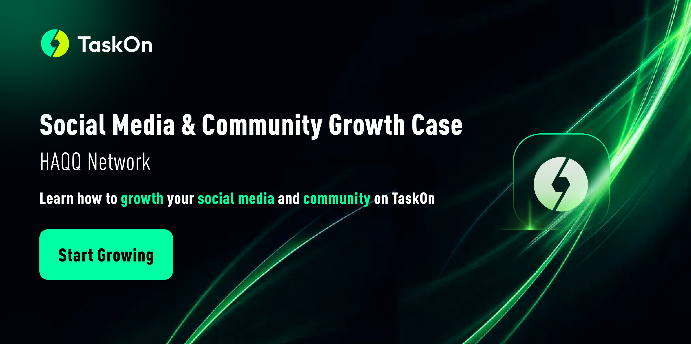
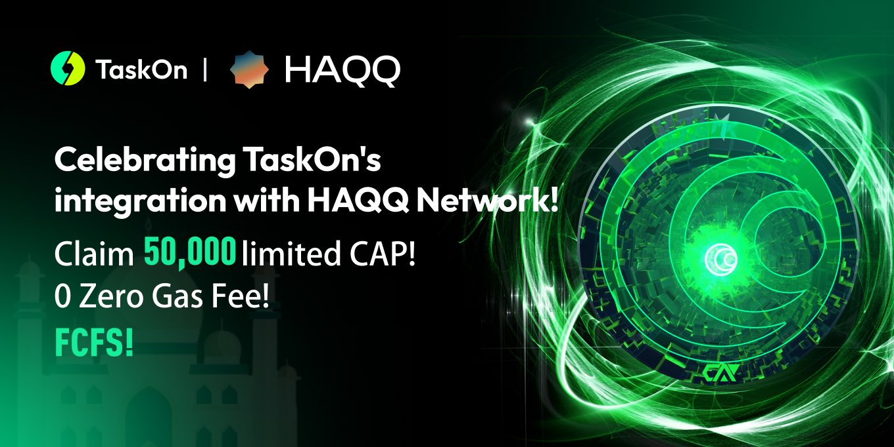

# Social Media & Community Growth Case

<figure><figcaption></figcaption></figure>

For projects, amplifying social media `exposure` and expanding the community presents a challenge in their `growth` journey. When a project is tasked with swiftly and efficiently capturing a substantial user interest on social media within a constrained timeline, and seamlessly integrating these users as `high-quality` participants into the `community`, this challenge becomes even more formidable.&#x20;

Perhaps drawing insights from the collaborative campaign of TaskOn and `HAQQ Network`: To rapidly expand social media exposure and `community scale` within a short timeframe, HAQQ partnered with TaskOn to launch a campaign. In this campaign, users were simply required to follow social media accounts, retweet campaign posts, and join the community to fulfill tasks, thereby sharing the prize pool totaling 50,000 `CAPs`. 

<figure><figcaption></figcaption></figure>

At the end of the campaign, more than **37,000** users participated, with **33,000** successfully completing all tasks and receiving rewards, resulting in an impressive completion rate of **89%**.

<figure><figcaption></figcaption></figure>

The high participation numbers on the campaign page were mirrored in real-time growth across social media and the community. During the campaign, HAQQ's `Twitter followers` increased by over **47,000**, while `Islamic's Twitter followers` grew by around **97,000**. Impressively, the campaign tweet garnered over **34,000** `retweets` and achieved an exposure of over **350,000**. Additionally, `Discord members` also rapidly surpassed **200,000** during the campaign. 

<figure><figcaption></figcaption></figure> <figure><figcaption>
[data source: Social Blade]
</figcaption></figure>

The growth in social media and community data underscores the significant impact of this campaign.&#x20;

Let's break down a few key steps that contributed to the success of this campaign:

1. **Clear and Simple Tasks**: Given that the primary objective was to drive growth in social media and the community, the entire task design revolved around this goal. Strategically, Twitter and Discord were chosen as key indicators of this growth. TaskOn's campaign participation interface was designed to be clear and straightforward, enabling users to immediately grasp the project's message: follow social media accounts and join the community. This approach encouraged a broader spectrum of users to join, aligning perfectly with the focus on community expansion.

<figure><figcaption></figcaption></figure>

If your goal also involves growing social media exposure and community, it might be worthwhile to draw inspiration from this campaign and use it as a launching point for rapid expansion. Learn how to [create a campaign](https://taskoncommunitys-organization.gitbook.io/entity-hub-for-business-end/tutorial/create-a-campaign) on TaskOn now.

2. Timely Reward Distribution: The real-time reward distribution mechanism, as observed on the campaign's details page, was noteworthy. Distributing rewards immediately upon task completion effectively heightened user motivation, fostering increased participation.

<figure><figcaption></figcaption></figure>

3. Effective Utilization of Promotion Channels: Leveraging promotion channels stood out as another key factor contributing to the campaign's success. Following the campaign's launch, both TaskOn and HAQQ actively promoted the campaign across social media platforms. Furthermore, TaskOn specifically allocated a carousel section and a dedicated recommended spot on the campaign page.

It's important to note that only campaigns from verified projects can be displayed in the recommended spot on the campaign page. This is beneficial for gaining greater exposure, so it's advisable to [create your project space](https://taskoncommunitys-organization.gitbook.io/entity-hub-for-business-end/tutorial/taskon-space) and complete the [verification](https://taskoncommunitys-organization.gitbook.io/entity-hub-for-business-end/tutorial/verification). 

<figure><figcaption></figcaption></figure>

The daily social media growth data indicates that there is a noticeable increase in user engagement during the initial days of the campaign and also on the final day. Therefore, it's essential to capitalize on these two prime periods of heightened user participation.

<figure><figcaption>
[data source: Social Blade]
</figcaption></figure>

Through a collaborative effort between HAQQ Network and TaskOn, remarkable achievements in social media and community growth were attained within a span of 20 days. The combined growth of **140,000** followers across the two official accounts and the evident transformation in exposure on social media paralleled significant changes in community members and engagements. These impressive statistics vividly demonstrate how HAQQ harnessed its partnership with TaskOn to effortlessly achieve growth in both social media exposure and community engagement.&#x20;

This is your moment to stand out and maximize this opportunity.
