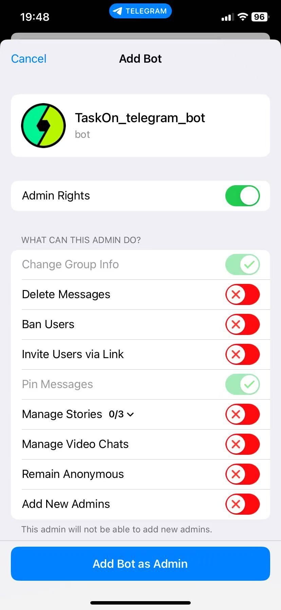

# Telegram Bot

<figure><figcaption></figcaption></figure>

## How to Add the TaskOn Telegram Bot

Telegram members can easily access real-time information about community tasks, ensuring seamless integration between Telegram and the community. 

Click on “`Community Hub`,” select “`Bot Integration`,” then click on “`Discord Integration`,” followed by “`Telegram Integration`,” and click the prompted buttons for _Automatic Notification on Telegram_ and _Predefined Commands on Telegram_.

<figure><figcaption></figcaption></figure>

The TaskOn Telegram Bot supports multiple features: _Automatic Notification_, _Predefined Commands_, and _Telegram Mini Program_. More features will be introduced in the future.

<figure><figcaption></figcaption></figure>

Check the appropriate box, enter your Telegram Group/Channel link, and click _Confirm_. You will be prompted to grant the bot permissions.

<figure><figcaption></figcaption></figure>

<figure><figcaption></figcaption></figure>

After clicking, you will be redirected to the Telegram bot page.

<figure><figcaption></figcaption></figure>

Click the bot’s chat page name, then select “Add to Group or Channel” and choose your community.

<figure><figcaption></figcaption></figure>

<figure><figcaption></figcaption></figure>

Add the bot as an administrator to your group or channel, granting the TaskOn Bot the necessary permissions and access.

<figure><figcaption></figcaption></figure>

Click “Admin Rights,” then select “Add bot as admin.”

<figure><figcaption></figcaption></figure>

#### **Automatic Notification on Telegram Group** 

1. In group,Locate the Bot and swipe lef&#x74;**.** click "`Restrict`", choose "`Send Messages`", then click "`Apply`".

<figure><figcaption></figcaption></figure>

<figure><figcaption></figcaption></figure>

#### Automatic Notification on Telegram Channel 

1. In Channel, click "`Administrators`".

<figure><figcaption></figcaption></figure>

1. Choose TaskOn\_Telegram\_bot.

<figure><figcaption></figcaption></figure>

1. Click "`Change Channel Info`", "`Post Messages`", "`Manage Stories`".
2. Click "`Done`".

<figure><figcaption></figcaption></figure>

#### Join Telegram Task Verification 

1. In group, click "`Administrators`".

<figure><figcaption></figcaption></figure>

1. Click "`Add Admin`".

<figure><figcaption></figcaption></figure>

1. Click "`Done`".

<figure><figcaption></figcaption></figure>
