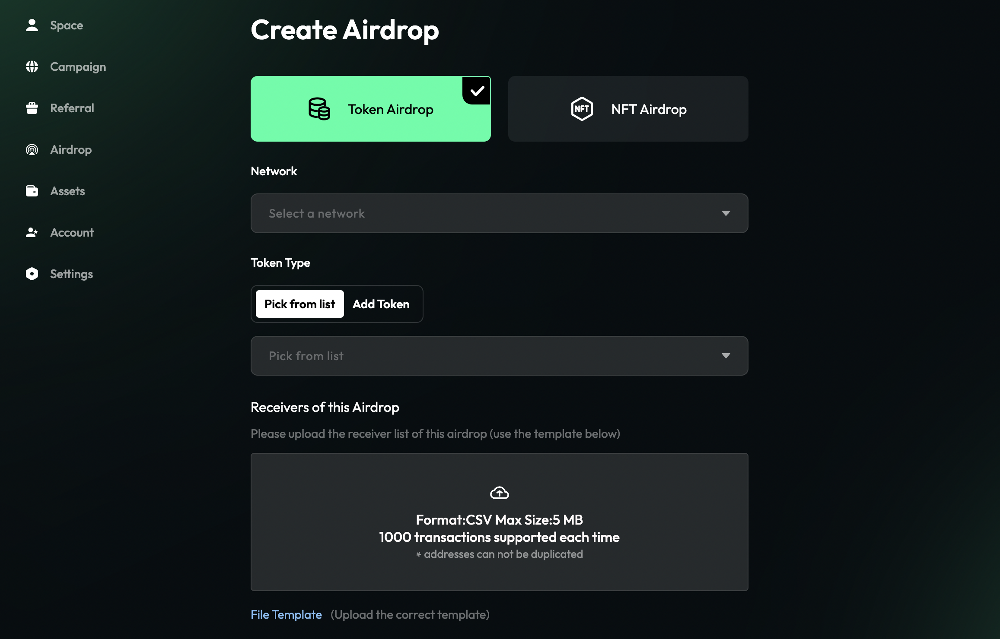

# Distribute Rewards

TaskOn's comprehensive `reward distribution system` facilitates quick and convenient reward distribution, ensuring a seamless and efficient process.

| **Rewards Types** | **By TaskOn** | **By Yourself** |
| ----------------- | ------------- | --------------- |
| Token             | ✓             | ✓               |
| NFT               | ✓             | ✓               |
| Whitelist         | ×             | ✓               |
| CAP               | √             | ×               |
| Extra Bonus       | ×             | ✓               |

If you choose to distribute rewards manually, please proceed to distribute the rewards based on the list of winners. Afterward, kindly inform participants that the reward distribution for the campaign has been completed through the official website or announcement center. If you have chosen reward distribution by TaskOn, please refer to “[**Deposit Rewards**](https://taskoncommunitys-organization.gitbook.io/entity-hub-for-business-end/tutorial/finish-campaigns-events/deposit-rewards)”

### Airdrop

Projects now have the ability to conduct airdrops, providing another way to distribute rewards to users.

<figure><figcaption></figcaption></figure>

The platform-based reward distribution offers automated processes and efficiency, while `self-distribution` allows for greater customization and control. You have the flexibility to choose the method that suits your preferences.
