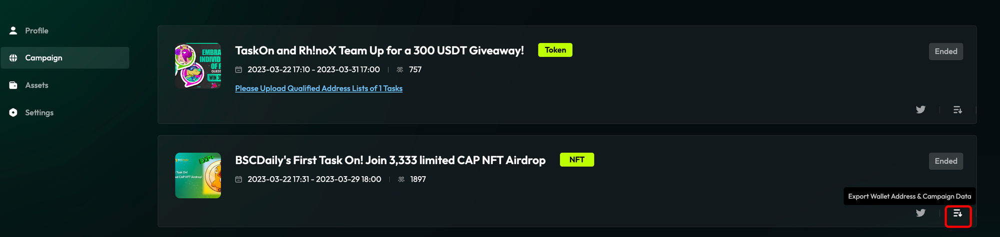
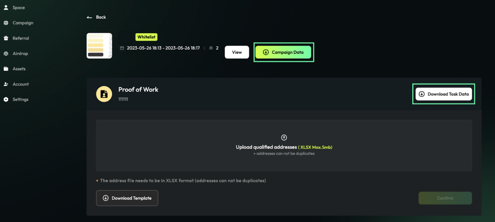

# Review PoW

1. In `Entity Hub`, enter the campaign page, and click “`Please Upload Qualified Address Lists of 1 Tasks`”

<figure><figcaption></figcaption></figure>

2. Download the full list of submissions by clicking “`Download Task Data`”.

<figure><figcaption></figcaption></figure>

3. Open the downloaded file, review user submissions, and filter out users that meet the criteria.
