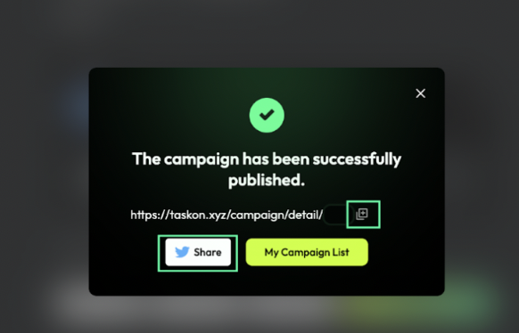
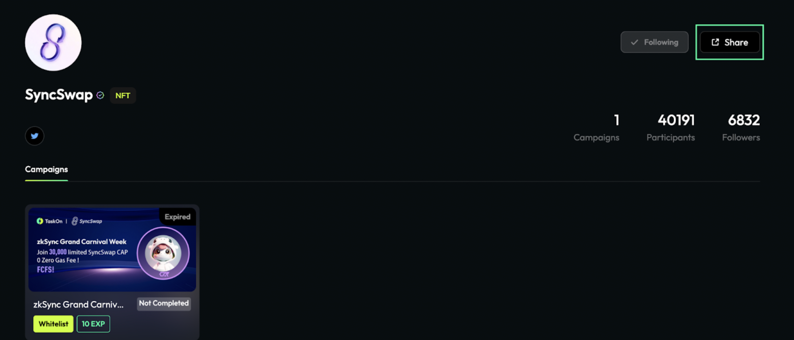
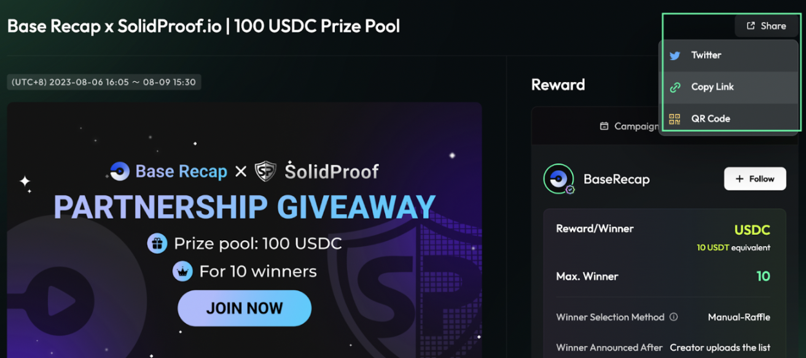
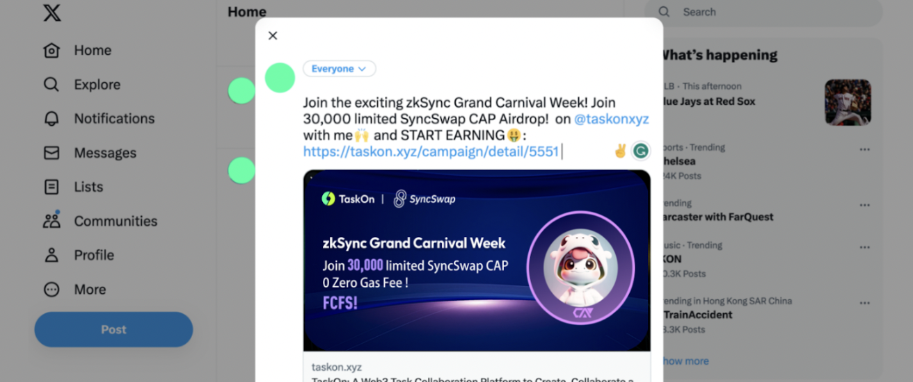

# Share Quests/Events

### Getting Started

1. Campaign Launch Page: After you publish the campaign, you can share this on social media by both copying the link or clicking on the Twitter icon.&#x20;

<figure><figcaption></figcaption></figure>

2. In Entity Hub, clicking "`Share`" presents three diverse sharing options, enabling effortless sharing of your project space and providing users with a seamless experience to share your projects.

<figure><figcaption></figcaption></figure>

<figure><figcaption></figcaption></figure>

3. Campaign Page: Besides the above, on the campaign page, you can also encourage users to promote your campaign.

<figure><figcaption></figcaption></figure>

4. We have thoughtfully provided the content for you if you click the Twitter icon, and you also have the freedom to personalize the text according to your preferences.

<figure><figcaption></figcaption></figure>

