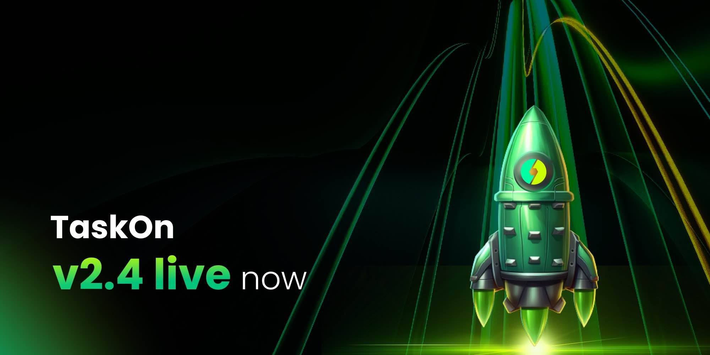

# v.2.4

<figure><figcaption></figcaption></figure>

We are pleased to announce the official launch of TaskOn v2.4! This release delivers deep optimizations to functional experience and user interaction, and introduces the novel “TaskChain” concept, empowering projects to configure multi-task workflows within Community Tasks. Also newly introduced are the continuous check-in task type — 30-Days Challenge — and Milestone rewards aimed at users achieving specific goals. Experience it now to explore more exciting features!

**TaskChain**

<figure><figcaption></figcaption></figure>

Within Community Tasks, the TaskChain design closely mirrors the embedded experience of ChainEran. It utilizes a card-based interface where multiple tasks link together like a chain, enabling a seamless “learn-by-doing” flow and helping projects conduct user education more effectively.

Tasks can have configured start and end times. By default, the system sets tasks to start immediately with no end time.

<figure><figcaption></figcaption></figure>

For Rewards, Token and points rewards are primarily supported. Token rewards operate on a FCFS basis with equal distribution among winners. Once the Token allocation is depleted, rewards switch to points (Open to All). Users who earn Token rewards also simultaneously receive points.

The process for setting up Task and Eligibility for a TaskChain is largely identical to that for a Quest.

For users, TaskChain presents tasks intuitively and allows for instant reward claiming upon completion, delivering a smoother overall experience.

**Multi-Day Challenge**

A type of TaskChain specifically designed to enhance user stickiness and encourage consecutive participation. It utilizes a daily task + time-lock mechanism to incentivize consistent user check-ins, effectively boosting user retention.

Multi-Day Challenge supports the automatic unlocking of daily tasks. After configuration in the backend, the time-lock mechanism locks subsequent, non-unlocked tasks. Users must complete the current day’s task and wait for one day to unlock the next content. Furthermore, leveraging the embedded TaskChain functionality, daily tasks can be configured as multi-task chains, meeting diverse operational needs for projects.

<figure><figcaption></figcaption></figure>

**After publishing a task, use the ‘Duplicate’ button to quickly copy it for creating identical ones.**

<figure><figcaption></figcaption></figure>

<figure><figcaption></figcaption></figure>

**Milestone**

The Milestone feature, located within the Incentive Center, provides communities with a customizable user achievement system to flexibly reward core contributors. Participation conditions can be set for Milestones, enabling more precise recognition of community contributors.

Milestones primarily support rewards based on points and levels. Points-based rewards can be configured to accumulate towards a goal over a specified time period.

<figure><figcaption></figcaption></figure>

Once a Milestone activity is published, users who meet the set requirements can claim rewards directly, making it easier to incentivize participation in community building.

* Example: Projects can customize points thresholds (e.g., 10 points) or level thresholds (e.g., Level 5).
* Diverse reward types are supported: Token, Discord roles, points, etc.

<figure><figcaption></figcaption></figure>

<figure><figcaption></figcaption></figure>

**Core Advantages:**

* Increased Engagement: Progressive reward systems stimulate continuous user investment.
* Goal Decomposition: Transforms large goals into executable small steps.
* Flexible Configuration: Supports custom incentive strategies based on points or levels.

**Retention Data Visualization:**

The new TaskOn version introduces a Dapp Retention Rate section within the Data Analytics module. This addition provides visualized charts, allowing clients to intuitively observe the retention metrics behind each campaign for more refined operations.

<figure><figcaption></figcaption></figure>

**Daily Retention Chart:**

* Daily Retention:\
  Shows how many new users return on the next day. Example: If there were 1,000 first-time active users yesterday, and 300 return today → the Day 1 retention rate is 30%.
* Weekly Retention:\
  Tracks users who joined during a specific calendar week and returned the following week. Example: 1,000 users joined between Aug 4–10, and 450 of them returned between Aug 11–17 → the Week 1 retention rate is 45%.

**White-Label Service**

**The enhanced White-Label Service allows the community interface to be embedded directly into the project’s main website navigation.This integration eliminates the need for page redirection upon clicking.**

**Furthermore, the user login system is synchronized with the project’s existing infrastructure, requiring no separate login and ensuring stronger overall brand consistency.**

For specific access to the White-Label Service, please contact the official TaskOn team:[https://t.me/Taskonpremium](https://t.me/Taskonpremium)
