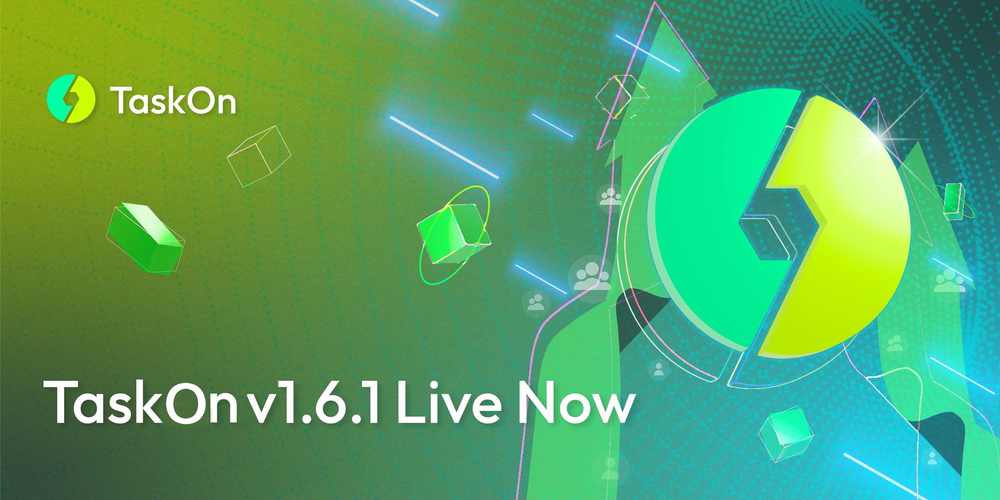

# v1.6.1

<figure><figcaption></figcaption></figure>

For Business-end, including:

* Add `Hashtag` Task, increase the popularity of activities with users retweeting.

<figure><figcaption></figcaption></figure>

* Add `Deposited Mark`, get it as soon as campaign creators deposit their rewards and use `Automatically Distribution` function.

<figure><figcaption></figcaption></figure>

* Add `Recommended Campaigns`. Recommended campaigns will display at the bottom of the campaign details page.

<figure><figcaption></figcaption></figure>

* Optimized Explore Page, including Featured Campaign, A New Filter Function, etc.

<figure><figcaption></figcaption></figure>

For More details:


