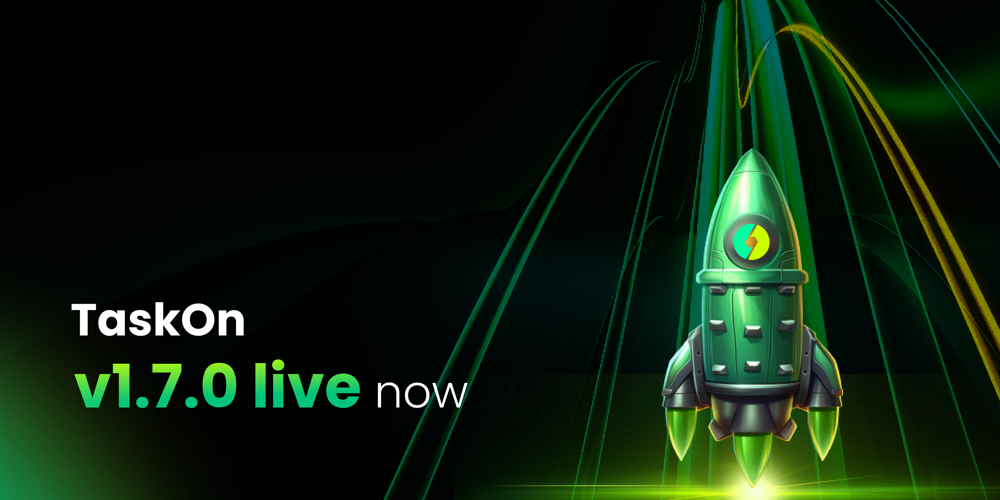

# v1.7.0

<figure><figcaption></figcaption></figure>

We are thrilled to introduce TaskOn v1.7.0 — a significant upgrade meticulously crafted to elevate the user experience for campaign creators. This release introduces many innovative features, including **Analytics Dashboard** and a brand-new **Filter Feature**. Moreover, a multitude of experiential enhancements have been seamlessly integrated. For comprehensive insights, kindly peruse the information provided below.

## For Projects 

### Analytics Dashboard 

TaskOn’s Analytics Dashboard is a powerful tool designed to elevate your project’s performance by providing in-depth insights through on-chain, off-chain, social, and governance data aggregation. Easily visualize key performance indicators and conduct multi-dimensional analyses for **Campaigns**, **Events**, and **Referrals**. Enjoy real-time data updates, enabling swift responses to market changes, and utilize the interactive charts to track metrics such as Visitors, Participants, and Conversion Rates. Accessible through the Entity Hub, the Analytics Dashboard empowers you to optimize your activities, boost engagement, and enhance overall project success.

<figure><figcaption></figcaption></figure>

### Effortless Access with Telegram and Email 

TaskOn now offers a seamless login experience through **Telegram** and **Email**, in addition to the existing options of Web3 Wallets, Twitter, and Discord. To enjoy this convenience, users can now directly log in using their Telegram or Email credentials without the need for additional steps. If you haven’t already, simply follow [**our tutorial** to bind your Telegram and Email accounts to your TaskOn profile](https://taskoncommunitys-organization.gitbook.io/entity-hub-for-business-end/tutorial/taskon-space/manage-your-space/bind-and-unbind) for a streamlined experience. Experience the ease of access and stay connected effortlessly on TaskOn — where logging in is made simple for you.

<figure><figcaption></figcaption></figure>

### Off-chain Task: Tweet with Specified Content

To further boost the exposure of your campaign, we now support tweet with specified content. You can request participants to adhere to specified content requirements when posting on Twitter, ensuring a more precise and targeted promotional impact.

 
