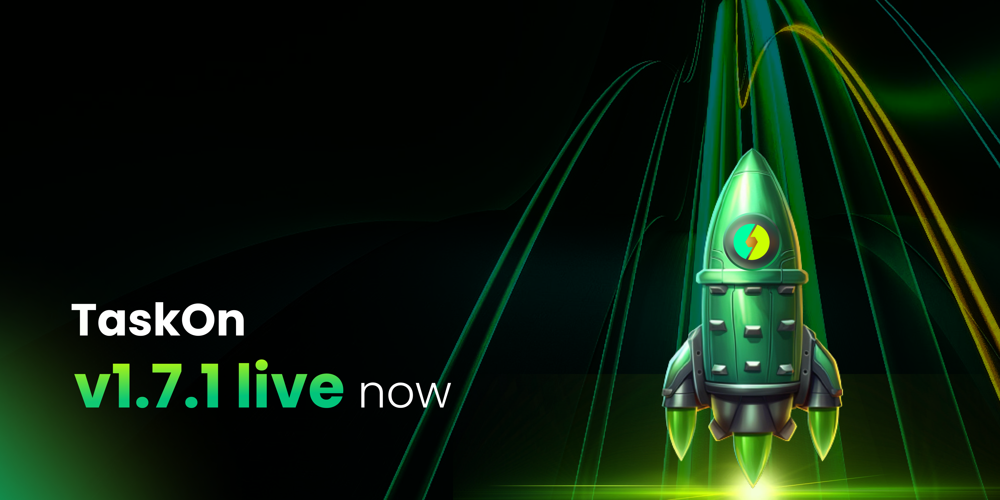
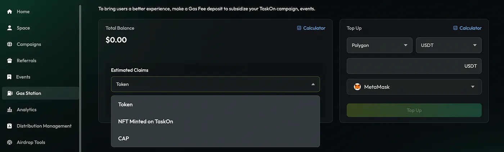
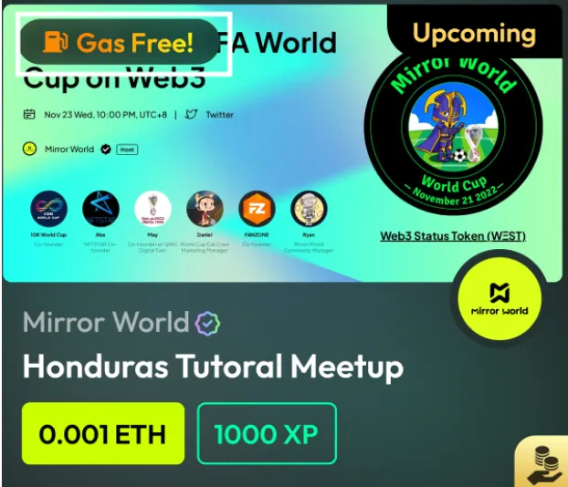
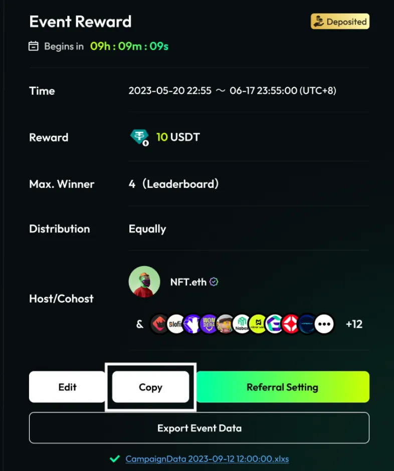
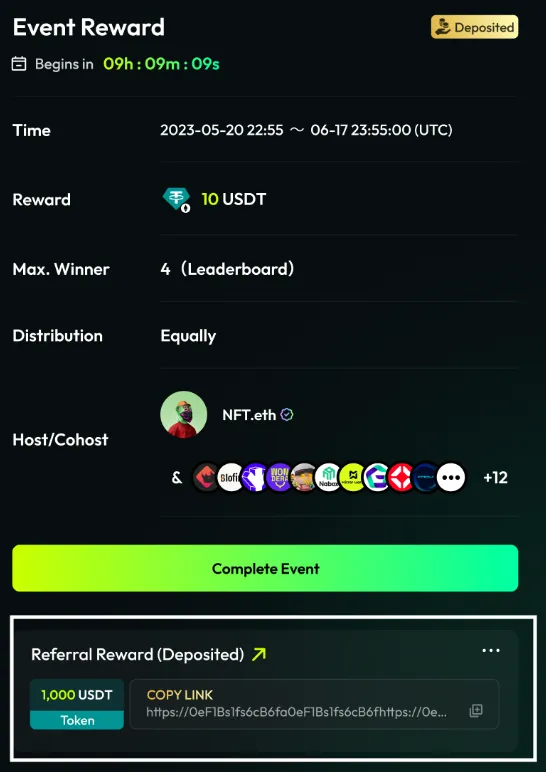
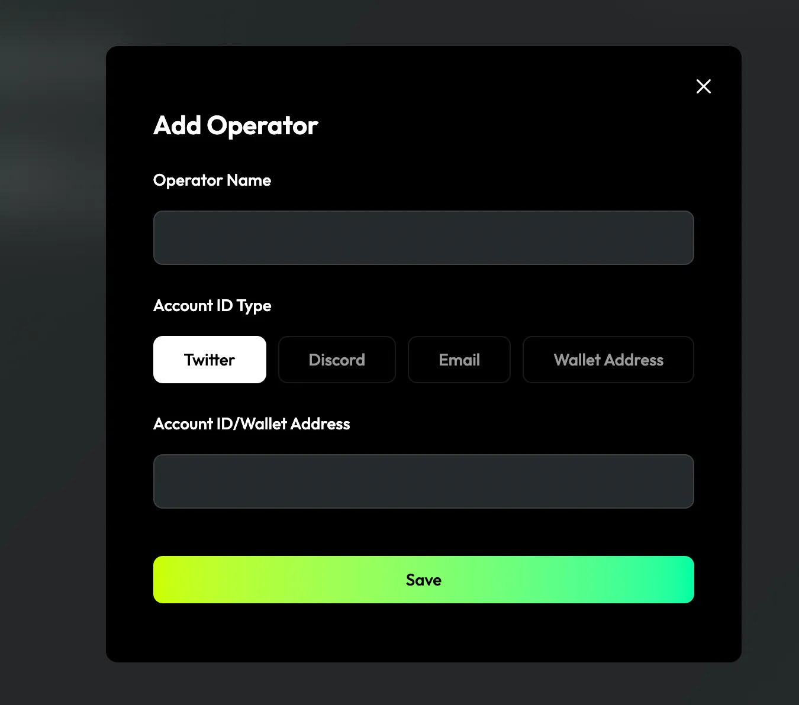
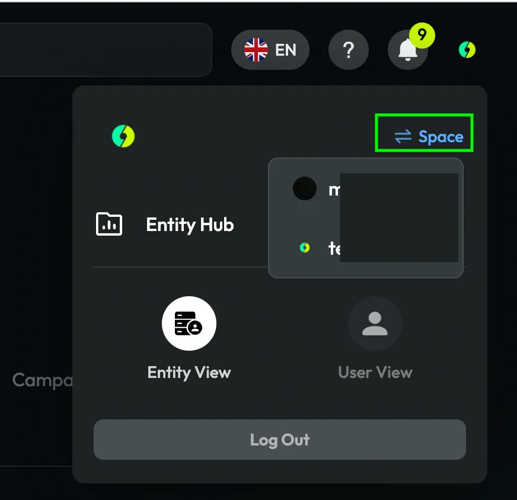
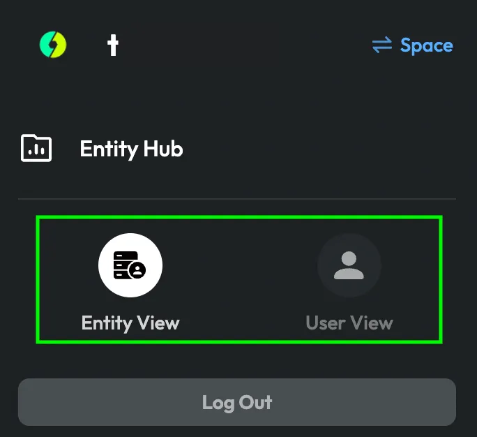
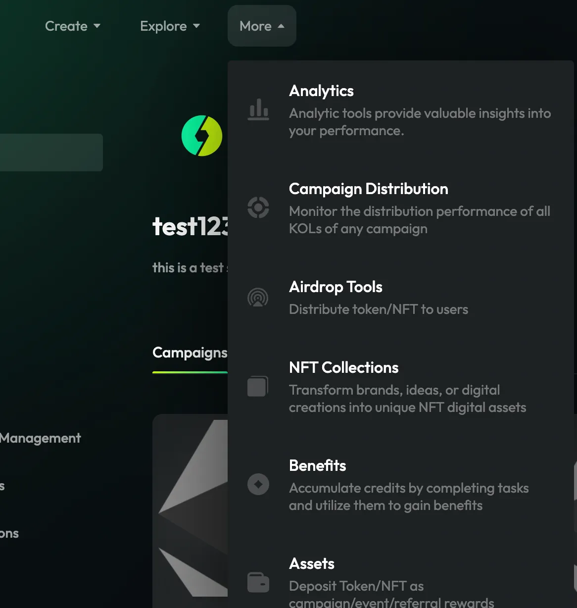

# v1.7.1

<figure><figcaption></figcaption></figure>

We are thrilled to introduce TaskOn v1.7.1 — a significant upgrade meticulously crafted to elevate the user experience for campaign creators. This release introduces many innovative features, including Gas Station and a brand-new Epic Banner. Moreover, a multitude of experiential enhancements have been seamlessly integrated.&#x20;

For comprehensive insights, kindly peruse the information provided below.

### Gas Station&#x20;

TaskOn v1.7.1 introduces the Gas Station feature to address a critical concern for user conversion rates. While attractive designs and rewards may draw users to activities, the fear of incurring gas fees can lead to participation abandonment. With Gas Station, projects cover users’ gas fees when claiming rewards, not only easing users’ financial burden but also providing projects with a competitive edge, fostering active participation, and driving up overall engagement and involvement.

<figure><figcaption></figcaption></figure>

It is worth mentioning that, to enhance the attractiveness of activities, we have specifically highlighted those activities that are Gas Free. Consequently, the activities you publish will be more likely to capture users’ attention, encouraging them to participate more actively.

<figure><figcaption></figcaption></figure>

### Epic&#x20;

We’ve introduced a new activity banner spot: `Epic`, specifically tailored for major `Festivals` (such as Christmas), `Odysseys`, and `Trending Topics` (such as BRC20). Relevant activities will be consolidated on the Epic banner page, making it easy for users to search and discover intriguing events. The Epic themes will be periodically updated to stay current with the times and popular discussions. If projects’ activity is featured in the Epic banner, it will receive increased exposure, extending beyond the exposure on the Campaign/Event Explore page.

<figure><figcaption></figcaption></figure>

### Event Optimization&#x20;

We’ve implemented a series of optimizations for the event feature to enhance the creation experience and promotional efficiency.

#### Copy Event&#x20;

Now, projects can easily replicate events with the same format by clicking “Copy”, streamlining the process of creating multiple events with identical templates. This feature saves projects’ significant time, allowing projects to quickly duplicate events and make necessary adjustments.

<figure><figcaption></figcaption></figure>

#### Support Referral

The latest version of the event feature now includes support for creating Referrals. Encouraging users to earn rewards by promoting Referrals enhances the visibility of event, attracting a larger audience.

<figure><figcaption></figcaption></figure>

### Space Operator&#x20;

Our latest update introduces the “Space Operator” role to streamline space management. Now, within the same space, space admin can designate multiple operators, efficiently allocating space management and activity execution responsibilities. Each operator has the ability to create activities, and access activity data, contributing to enhanced collaboration efficiency.

<figure><figcaption></figcaption></figure>

Space operators having the ability to centrally manage multiple spaces within a single account simplifies the supervision and administration of various projects or activities. This facilitates operators in seamlessly switching between and handling tasks in different spaces. Accessing different spaces is as simple as switching within the Entity Hub, streamlining the process.

<figure><figcaption></figcaption></figure>

### User Experience Optimization&#x20;

We’ve made some optimizations for the experience of creators. Creators can now click on the profile image in the top right corner to switch between product perspectives: Entity View or User View.

<figure><figcaption></figcaption></figure>

The navigation bar has also been refined. In the creator perspective, you can quickly access pages related to activity creation/analysis by clicking on the navigation bar.

<figure><figcaption></figcaption></figure>

### Reward Settings Optimization&#x20;

In our commitment to improving activity quality and encouraging user participation, we have carefully adjusted the reward settings for deposited rewards to achieve optimal results.

#### Minimum Deposited Reward Balance&#x20;

Minimum Deposited Reward Balance For activities utilizing tokens as rewards, we have implemented a minimum reward amount requirement: $50. This ensures that the rewards offered maintain a certain standard, contributing to the overall quality and attractiveness of the activity.

For `campaigns`, the minimum rewards value is `$50`. If the reward value is below $50, projects can still publish the campaign, but its permissions will automatically switch to `Private`.

For `events`, projects need to set `a minimum reward value of $50` to successfully publish event.

<figure><figcaption></figcaption></figure>

### Application for Inclusion of Non-Mainstream Tokens in Rewards&#x20;

Considering that some non-mainstream tokens may not have recorded prices on our platform, making it challenging to estimate the value of deposited rewards, we have introduced an application process for non-mainstream tokens. Activity creators can fill out the application form to provide additional information about their deposited rewards. After awaiting operational review and receiving approval, the applied non-mainstream tokens will be marked with a price, allowing for the calculation of their value. This feature provides a secure and streamlined process for incorporating various tokens into your reward offerings.
