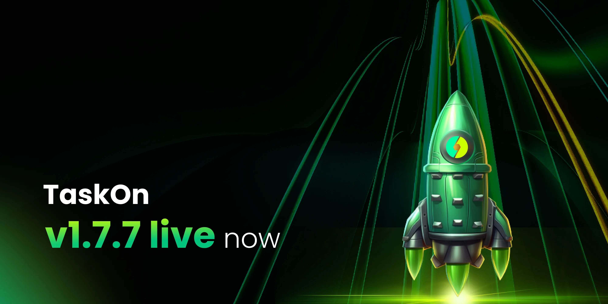

# v1.7.7

<figure><figcaption></figcaption></figure>

## For Project 

### TaskOn Community version 

**Benefit Shop**

To further incentivize and reward active members of the projects’ community, we’re introducing the **Benefit Shop**. Upon completing tasks within the community and accumulating certain points, members can exchange them for various rewards in the Benefit Shop, including **Token**, **NFTs**, **Discord Role**, **Whitelists**, **Content**, **Promote Code** **and more**. The specific rewards are determined by the project community to ensure diversity and appeal.

The Benefit Shop not only provides rewards but also serves as recognition for members’ contributions, enhancing their sense of value and importance within the community thereby increasing loyalty. By offering valuable rewards, we encourage continued participation in community activities, fostering ongoing growth and conversion.

<figure><figcaption></figcaption></figure>

<figure><figcaption></figcaption></figure>

**Referral Program**

The Referral Program is designed to reward projects for referring their friends’ projects to register on TaskOn and become paying members. The commission rate is determined by factors such as the number of referrals and the scale of their payments.

We believe that the Referral Program will be a valuable addition to your toolkit for community growth and conversion on TaskOn. Collaborating with other projects on TaskOn can lead to mutually beneficial partnerships and collaborations, further enhancing the growth and success of your project.

_\*The referral program is exclusive to users with a community plan subscription and whitelisted users._

<figure><figcaption></figcaption></figure>

**Task Template: Reddit**

In this version, we have introduced a new task templates: Reddit. This new task templates provide more choices and flexibility, enabling you to target your audience more precisely and achieve optimal community growth and conversion.

<figure><figcaption></figcaption></figure>

**Custom Theme**

To enhance the immersive community experience for members, in the new version, TaskOn now supports customizable community interface color schemes. You can personalize your community space according to your project’s color design. Currently, both light and dark modes are available.

<figure><figcaption></figcaption></figure>

**Multiple Language Support: Japanese, Spanish, Russian, Korean**

We are thrilled to introduce our multi-language feature, currently supporting **Japanese, Spanish, Russian, Korean**, apart from English. But that’s just the beginning — we have exciting plans to incorporate even more languages in the near future. This evolution is all about enhancing the user experience for our global community, ultimately fueling the growth of your projects.

<figure><figcaption></figcaption></figure>

## For Participants 

**Benefit Shop**

After completing tasks within the community and accumulating a certain number of Community Points, members can exchange them for various rewards in the **Benefit Shop**. These rewards include **Tokens**, **NFTs**, **Discord Roles**, **Whitelists**, **Content, Promote Code**, **and more**. The specific rewards are determined by the project community to ensure diversity and appeal.

The Benefit Shop serves as recognition for members’ **contributions** and as evidence of their active participation within the community. It is a way for the community to acknowledge and reward the efforts of its members, encouraging continued engagement and fostering a sense of belonging.

<figure><figcaption></figcaption></figure>

**Task Template: Reddit**

In the new version, we’ve introduced a brand-new task templates: Reddit. These templates are designed to help you delve deeper into the community of projects you’re interested in and integrate more swiftly, allowing you to experience the functionalities of the projects.

<figure><figcaption></figcaption></figure>

**Multiple Language Support: English, Japanese, Spanish, Russian, Korean**

We’ve just introduced an exciting enhancement: multi-language support. Currently, we offer **English**, **Japanese, Spanish, Russian, Korean**. And in the future, we’re gearing up to add even more languages to cater to users from diverse regions. A richer and more tailored user experience just for you.

<figure><figcaption></figcaption></figure>
