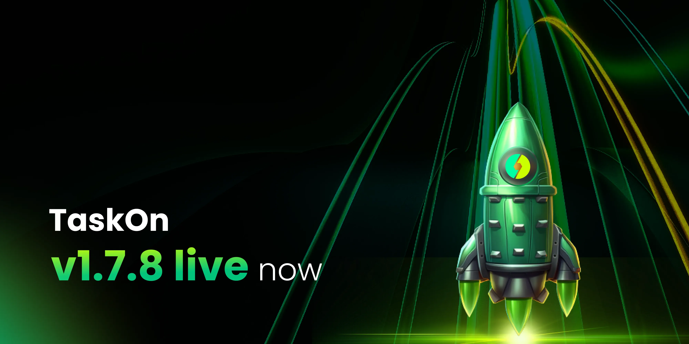

# v1.7.8

<figure><figcaption></figcaption></figure>

## For Projects 

### **New Task Templates** 

**Invite Friends to Discord**

Introducing our latest task template designed to boost community growth and engagement: “**Invite Friends to Discord**”. This template encourages current community members to actively invite their friends to join the project’s Discord server. By leveraging the power of personal recommendations and social connections, this task template aims to expand the community’s reach and foster a more vibrant and interactive environment.

<figure><figcaption></figcaption></figure>

### **Smart Tasks** 

In addition to automatically creating tasks related to platform X, the new version of Smart Task now supports integration with Medium and Youtube. By entering the URL of Official Medium or Youtube Channel, projects can automatically create community tasks for reading/watching, and sharing articles or videos.

<figure><figcaption></figcaption></figure>

### **TaskOn Bot Optimization** 

The bot now includes enhanced features such as Automatic Notifications and Predefined Commands to improve community engagement and streamline user interactions. With automatic notifications for task reminders, reward announcements, and event alerts, members stay informed and motivated. Additionally, new command line instructions allow users to complete tasks, query points, and check their levels with ease, enhancing their overall experience. These improvements aim to boost user engagement, simplify task management, and foster a more interactive community environment.

<figure><figcaption></figcaption></figure>

### **Community Operator** 

Our latest update introduces the “Community Operator” role to streamline community management. Now, community admin can designate multiple operators within the same community, efficiently allocating community management and activity execution responsibilities. Each operator can create tasks, and access data, contributing to enhanced collaboration efficiency.

<figure><figcaption></figcaption></figure>

### Onboarding Process Optimization 

We have optimized the onboarding process where projects can input their official website URL, and the system automatically retrieves basic information for pre-filling. This reduces manual input significantly. Projects simply need to verify the accuracy and completeness of the information and make modifications as necessary. Additionally, TaskOn provides predefined community setup templates, allowing users to quickly create community tasks according to their specific needs.

<figure><figcaption></figcaption></figure>

### **Homepage Optimization** 

In the new version, Community has introduced a brand new Homepage aimed at assisting projects in creating more comprehensive communities and managing them more efficiently. Users can now utilize the To Do List to view and address priority tasks, ensuring smooth community operations. Additionally, the Home page displays real-time updates on community-wide data changes, enabling project teams to monitor key metrics promptly and make informed decisions.

<figure><figcaption></figcaption></figure>

### **Task ID** 

Task IDs ensure that each task has a unique identifier, facilitating easier collaboration among team members to share responsibilities and track progress. Moreover, in case of any issues with a particular task, these IDs help the development team swiftly pinpoint and trace related problems or updates.

<figure><figcaption></figcaption></figure>

### Supports Nibiru Network and Wallet Leap 

For the Nibiru network, TaskOn provides support for token, whitelist rewards and their wallet Leap. With this update, projects now have a broader range of reward options and settings, enhancing the flexibility and efficiency of your growth plans.

<figure><figcaption></figcaption></figure>

<figure><figcaption></figcaption></figure>

### API-verified Task Template Supports Social Media Platforms 

To enhance user experience, the API-verified Template now supports social media platforms such as X, Discord, Telegram, and Email. Community interaction is strengthened by integrating these social media platforms and communication methods, improving the overall experience.

<figure><figcaption></figcaption></figure>

<figure><figcaption></figcaption></figure>

## For Participants 

### Homepage Optimization 

In this version, we’ve enhanced the user experience on the participant homepage. Upon entering the community, users can now stay updated with the latest project developments: in addition to the regular tasks, they can access sprints, the benefit shop, TGE information, and more. On the far right, we’ve introduced a permanent personal center where users can quickly view their contributions to the community, rewards earned, and other relevant information.

<figure><figcaption></figcaption></figure>

### New Task Template 

**Join Friend to Discord**

Invite your friends to join projects’ Discord servers, and help them to grow and connect with more like-minded individuals. The more friends you invite, the stronger our community becomes.

<figure><figcaption></figcaption></figure>
