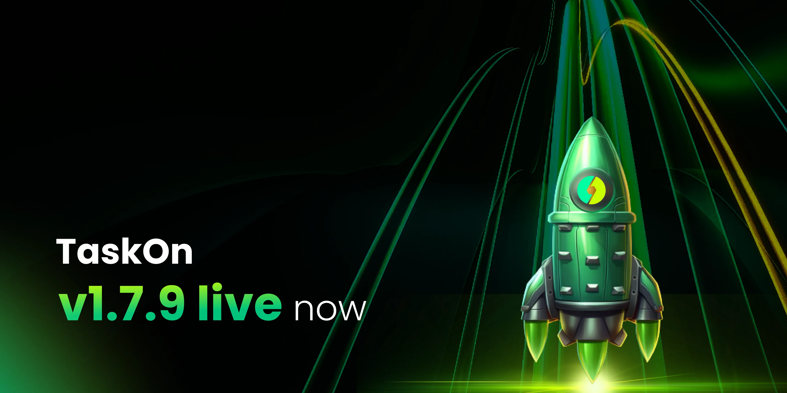

# v1.7.9

<figure><figcaption></figcaption></figure>

## For Projects 

### New Task Templates 

**AMA**

AMA (Ask Me Anything) is a real-time platform for project teams to engage with the community. This interaction boosts community engagement, enhances activity, and builds loyalty. It also helps projects establish trust, showcase transparency and expertise, and collect valuable feedback to refine their strategies and direction.

<figure><figcaption></figcaption></figure>

### **User Profile** 

In the Member List sector, we’ve added multiple dimensions of member information, including IP, on-chain address details (active time, transaction count, current balance, etc.), transaction counts with your project, and more.\
By clicking on an individual member, these details will be displayed in the right sidebar, allowing you to view user information in real time without downloading all member data.

<figure><figcaption></figcaption></figure>

### Event 

In the new version, projects now have the ability to initiate an Event on their community, designed to provide projects with a more immersive sprints engagement experience. This feature empowers projects to aggregate multiple sprints under an “Event” offering users a more diverse range of participation opportunities. What’s even more exciting is that projects can invite collaborators to co-launch events, collectively creating multiple sprints and generating a wider impact.

<figure><figcaption></figcaption></figure>

### Eligibility Optimization 

Refined condition settings help campaign and sprint creators better control participant quality, improving the effectiveness and data authenticity of campaigns or sprints.\
We’ve optimized the criteria for user participation by adding various optional conditions, including Google CAPTCHA, X account verification, on-chain verification, member level, Discord role, and tasks. These verification measures reduce fake accounts and bots, while criteria such as community member level and Discord role allow for more precise targeting of users, ensuring that participants meet the campaign/sprint requirements.

<figure><figcaption></figcaption></figure>

### Homepage Optimization 

Homepage Optimization enhances user experience by improving layout and navigation, leading to increased engagement and better conversion rates.

<figure><figcaption></figcaption></figure>

### Leaderboard Incentives 

To boost user engagement and activity, TaskOn has introduced a new feature: **Leaderboard Incentives**. With this feature, projects can specify a particular time frame during which users must complete specific tasks or meet certain criteria to earn limited-time rewards. This mechanism not only encourages users to participate more actively but also adds a sense of urgency, motivating them to act quickly within the given time frame.

<figure><figcaption></figcaption></figure>

**Nibiru Network: Vote & Hold NibID Domain**

In this version, TaskOn has integrated with Nibiru Network to introduce two new on-chain templates: Voting and Hold NibID Domain\
The Vote on Proposal template simplifies community participation by embedding voting links within tasks, enhancing convenience and boosting engagement.

<figure><figcaption></figcaption></figure>

**The Hold NibID Domain template** incentivizes users to retain domains or assets related to the Nibiru project, rewarding them based on their commitment to these holdings.

<figure><figcaption></figcaption></figure>

## For Participants 

### Leaderboard Incentives 

Leaderboard incentives are a limited-time reward system offered by project communities. By completing tasks or participating in activities, you can improve your ranking on the leaderboard and earn various rewards or perks.

<figure><figcaption></figcaption></figure>

### X Easy Task 

We have introduced a new section called “Easy X Task”, which consolidates all X-related tasks within the community. Users can directly view detailed information about each task in this section, including participation requirements and rewards. This integration allows users to quickly find and access X-related tasks, streamlining the process and making it easier to complete tasks and earn rewards.

<figure><figcaption></figcaption></figure>
