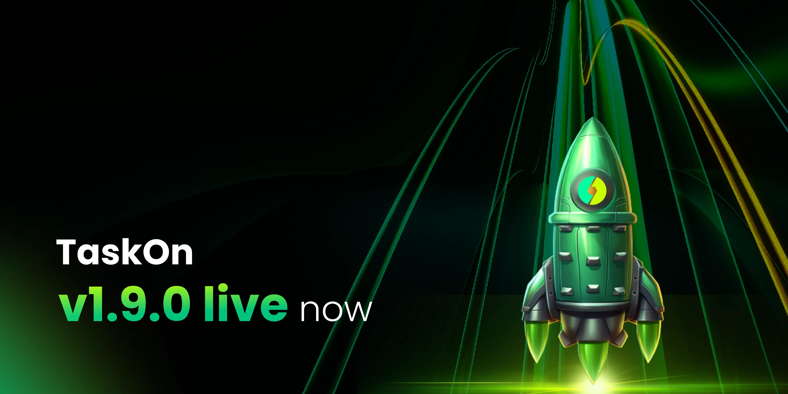

# v1.9.0

<figure><figcaption></figcaption></figure>

In TaskOn v1.9.0, we’ve consolidated the campaign and community sections into a unified experience. This update aims to simplify workflow and enhance community interaction by:

* Unified Dashboard: Users can now manage both campaigns and community activities from a single dashboard, making it easier to track progress and results.
* Cross-functional Features: Campaign tools are now seamlessly integrated into community activities, enabling real-time engagement and incentivization across both areas.
* Enhanced Collaboration: Communities can collaborate more effectively, with access to campaign insights and member activities all in one place.

This merge enhances operational efficiency by reducing the need to toggle between different modules and aligning tools with real-world community needs.

<figure><figcaption></figcaption></figure>

## **Quests**

The new **Quest** feature is designed to drive deeper user engagement. Quests allow community managers to create a series of tasks or challenges that users can complete to earn rewards, fostering a more interactive and rewarding experience.

Key benefits include:

* **Customizable Quests**: Design quests tailored to your community’s goals, from educational challenges to interactive tasks.
* **Real-time Progress Tracking**: Track user engagement and quest completion in real-time, ensuring transparency and motivating participation.
* **Increased Retention**: Quests offer a fun and rewarding way for users to stay active and engaged, driving long-term retention.

<figure><figcaption></figcaption></figure>
