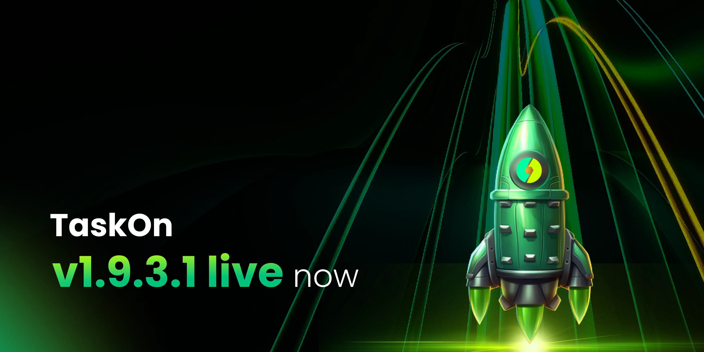

# v1.9.3.1

<figure><figcaption></figcaption></figure>

We are thrilled to introduce TaskOn v1.9.3.1, a continuation of our efforts to streamline the experience for our users and enhance the functions for our projects. Check out the new features in this version!

**1.** In this version, projects can **integrate their task API in Go-to-Community**, which greatly enhances their flexibility in terms of allocating reward points. Previously, a task was assigned a fixed reward point, and projects had to create distinctive tasks in order to reward the participants properly. The **API integration** allows projects to assign their tasks a dynamic reward point, which is determined by the participant’s activity.

<figure><figcaption></figcaption></figure>

**2.** Projects can now set up **multiple Points** simultaneously. Before their TGE, projects typically encourage their participants to contribute in a variety of ways like social media buzz, on-chain trade, and TVL. With **multiple Points**, projects can recognize the different kinds of contributions and reward the participants accordingly.

<figure><figcaption></figcaption></figure>

**3.** With our **new epic interface**, users can easily switch between quests within the epic. This immersive experience allows them to complete more quests.

<figure><figcaption></figcaption></figure>

**4. The display of quests** has been further optimized in this version, which means that the users can identify the preferred quests more intuitively.

<figure><figcaption></figcaption></figure>

**5.** We have introduced **multiple new entries to create communities**, which provides more convenience for projects.

<figure><figcaption></figcaption></figure>
