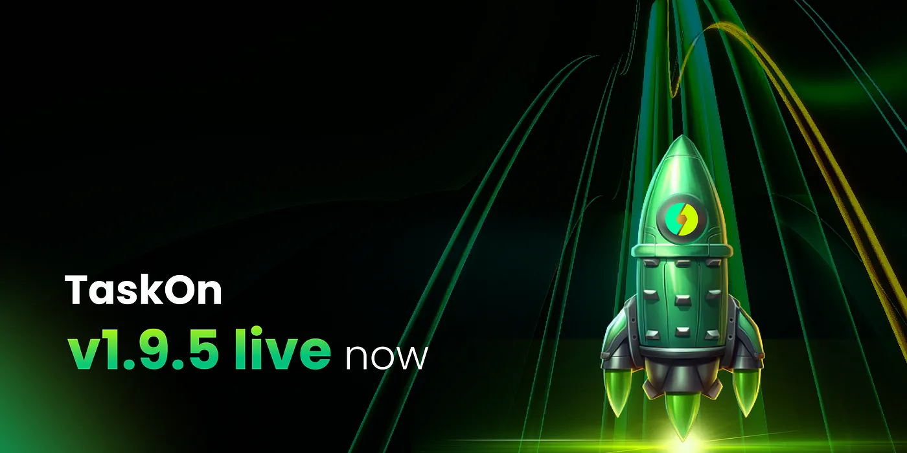

# v1.9.5

<figure><figcaption></figcaption></figure>

We are thrilled to introduce **TaskOn v1.9.5**, a continuation of our efforts to streamline the experience for our users and enhance the functions for our projects. In this version, we have added several new features like **Community Customization**, **Enhanced Proof of Humanity**, and **Streamlined Telegram Binding** that will transform your TaskOn experience!

On the community page, we have added three columns that recommend the hot projects that either have recently announced TGE, or are well funded, or offer attractive incentives, so that the participants can identify their preferred communities with more ease. Click the dice on the upper right corner to refresh!

<figure><figcaption></figcaption></figure>

We have enhanced the community customization feature in this new version. Aside from the logo and banner, projects can now provide an intro, add the starting date of the TGE, list their quests and events, etc. In this way, not only can projects further individualize their communities to attract participants, but also provide updated information to the existing members.

<figure><figcaption></figcaption></figure>

In an effort to further enhance the anti-robot mechanism, we have introduced Proof of Humanity in the quest creation process. Projects can choose between Binance, Gate, OKX, Bybit, KuCoin, and Coinbase. In this way, projects can rest assured that their security is guaranteed. More features like World ID will soon be introduced!

<figure><figcaption></figcaption></figure>

Telegram has always been important to your TaskOn as well as Web3 experience. In this version, we have added a new method for users to link their Telegram accounts to their TaskOn accounts. Just one click, and the TaskOn bot will be authorized!

<figure><figcaption></figcaption></figure>
