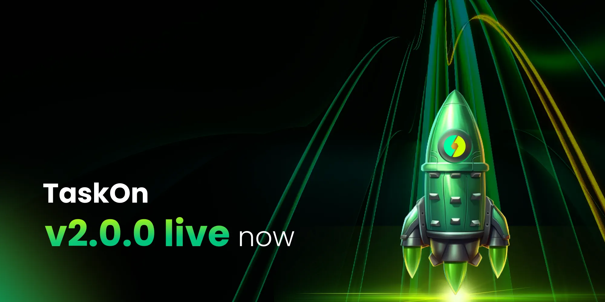

# v2.0.0

<figure><figcaption></figcaption></figure>

We’re excited to introduce TaskOn v2.0.0, a major release that supercharges our onchain experience for users and builders alike.

With a new ChainEarn Module, upgraded task infrastructure, a full backend system, and precision tools for campaign management, this release brings us one step closer to an integrated, onchain-first future.

The newly upgraded TaskOn v2.0.0 initiates a new era for on-chain actions. Its core ChainEarn module operates as a customized CPS advertising model, delivering results-driven outcomes — whether increasing token holders or boosting swap volumes — with three critical advantages:

Rapid efficacy

Minimal capital risk

Low operational overhead

**Even if initial targets deviate from final outcomes:**

Projects only pay for achieved results;

All participation still generates zero-cost brand exposure.

**By creating precision-targeted, long-duration OnChain Tasks — requiring users to buy/sell specific token amounts on designated DEXs — ChainEarn:**

↑ On-chain transaction frequency

↑ DEX trading volume & holding addresses

↑ Average token holding duration

Stimulates buy/sell market activity

Breaks the death spiral of low liquidity → high slippage

Enhances community engagement & topical relevance

Attracts new external users

## **ChainEarn: How It Works?** 

To achieve target outcomes, projects must establish attractive reward pools and campaign parameters.

Via Onchain Boost, projects create precision-targeted tasks on ChainEarn. This enables one-stop configuration of:

* **Hold Token campaigns**
* **Swap Transaction requirements**

<figure><figcaption></figcaption></figure>

Users must buy/sell or hold specified token amounts on designated DEXs. By completing these on-chain tasks, users directly contribute to:

* ↑ Liquidity provisioning
* ↑ Market depth

Projects set:

* Total reward pool size
* Cost-per-acquired-user (CPA)

Upon campaign submission, TaskOn algorithmically matches tasks to relevant users based on:

* Set CPA targets
* Campaign duration
* Success metrics

Operational Workflow:

1. For long-cycle user acquisition campaigns, TaskOn decomposes objectives into sub-targets executed in shorter sprints.\
   &#xNAN;_→ Mitigates “reward fatigue” and protracted payout cycles_
2. Tasks deploy to frontend with real-time progress tracking.
3. Automated payouts trigger only upon on-chain validation of task completion.

<figure><figcaption></figcaption></figure>

Critical Reminder: Project teams _must_ calibrate reward pools to incentivize target behaviors — this remains foundational to outcome efficacy.

## **4.Optimizing ChainEarn’s Onchain Boost Tool** 

**Onchain Boost Workflow:**

Log in to TaskOn → Select “For Projects” → Access Dashboard

<figure><figcaption></figcaption></figure>

Navigate to **Onchain Boost in the left control panel**

<figure><figcaption></figcaption></figure>

**I. Task Type Selection**

**Choose your Onchain action:**\
**A. Hold Token Campaigns**

1. **Require users to:**

* **Trade specified tokens on designated networks**
* **Maintain continuous holdings**

**2. Configure:**

* **Minimum token balance threshold**
* **Required holding duration (in days)**

<figure><figcaption></figcaption></figure>

**3. Set target:**

* **Number of qualifying wallets**

**4. Select reward tokens:**

* **From any supported network**

**5. Automated cost calculation:**

* **System displays cost-per-target wallet**

**6. Release:**

* **Set Schedule → Fund reward pool → Publish**

<figure><figcaption></figcaption></figure>

**B. Swap Campaigns**

1. **Direct users to:**

* **Execute swaps on integrated DEX**

**2. Customize requirements:**

* **Specific DEX or TaskOn aggregator**
* **Source token → Target token conversion**
* **Minimum swap volume (e.g., $1/user) ↓ Entry barrier**

<figure><figcaption></figcaption></figure>

**3. Prioritize objectives via:**

* **Target Wallets | Target Volumes | Target Transactions**

<figure><figcaption></figcaption></figure>

**4. Finalize:**

* **Target + Budget + Duration → Fund → Publish**

<figure><figcaption></figcaption></figure>

<figure><figcaption></figcaption></figure>

**II. Post-Submission Process**

1. **TaskOn operations team configures:**

* **Optimal campaign cycles**
* **Reward structures**

**2. Campaign deploys to ChainEarn homepage with:**

* **Real-time visibility: Hot tasks | Reward value | Progress**

**3. Users participate via guided workflows**

<figure><figcaption></figcaption></figure>

Note: TaskOn may rationally restructure campaigns

* Duration/rewards may differ from initial settings
* Objectives split into phased sprints for target alignment

**III. Live Monitoring & Security**

1. Real-time dashboard tracks:

* Backend metrics (granular analytics)

2\. Configurable anti-bot solution ensures:

* Authentic user participation
* Efficient user acquisition

### Campaign Console for Projects 

* Onchain Boost Dashboard: Projects can now launch and manage quests directly, define token rewards, and monitor real-time performance via the Onchain Boost.
* Secure Approval Workflow: All tasks are thoroughly reviewed for integrity and security before being made live.
* CPS-Based Campaign Model: Projects can run cost-per-sale-based campaigns with confidence, knowing TaskOn tracks and delivers verified participation data.

## **5.Dedicated Onchain Page** 

Explore onchain tasks in one place — from token swaps and bridges to token-holding actions. Every task is optimized for smooth completion and better rewards.

Zoom image will be displayed

<figure><figcaption></figcaption></figure>

**Dynamic UI Modules**

Our homepage now highlights top Onchain tasks, live updates on reward value, and user XP progress.

<figure><figcaption></figcaption></figure>

**GEM System**

Complete onchain tasks to earn GEMs, TaskOn’s internal system for tracking user participation and eligibility for future perks.

<figure><figcaption></figcaption></figure>

## 6.Benefits for Users 

* **Seamless Onchain Experience**: From wallet connection to token verification and swap guidance, the process is intuitive and user-friendly.
* **Level-Up Task Design**: Actions range from easy onboarding steps to long-term token holding missions, helping users grow in onchain maturity.
* **Transparent Rewards**: Real-time data on reward pools, task difficulty, and claim status ensure a fair, gamified experience.
